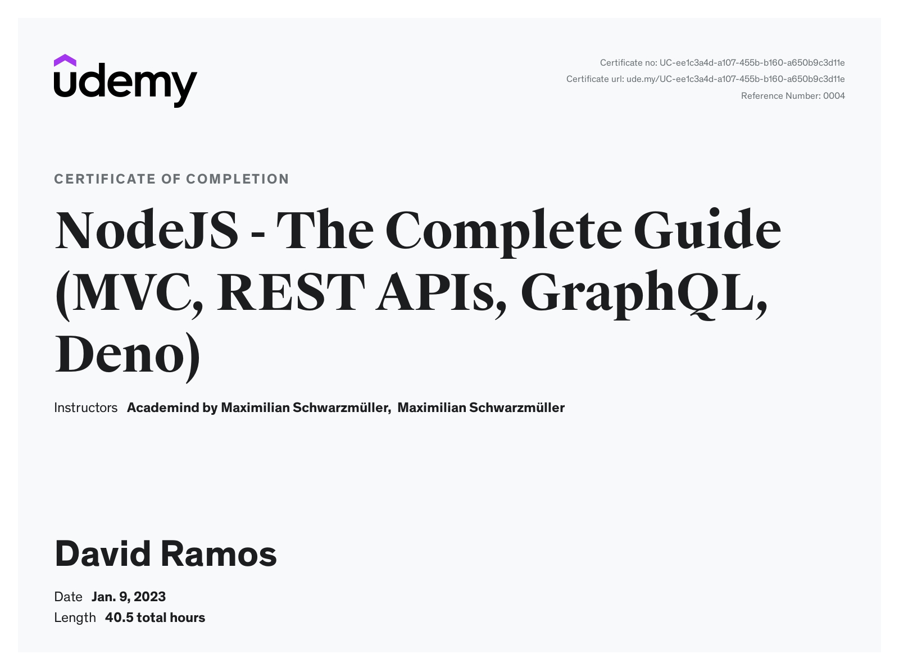

# Introduction

This repo contains my practice while following the NodeJS course taught by Maximilian Schwarzmueller. But it has many differences compared to the original resource, the most important ones being:
- Everything done using Typescript, and async/await instead of Promise chaining.
- A complete refactor on the React project supplied by the author to complement his backend code for learning REST APIs, socket.io and GraphQL (modules 25 to 28).

The original React code (from 2018), was done using JavaScript and following some old conventions (like class components to handle state), manual form validation, .css files, react-scripts to generate the React project.

My version instead, uses one of the last Vite templates for React + Typescript, and replaces all styling with Tailwind & styled components with twin.macro. It also uses Redux, @reduxjs/toolkit and RTK-Query to handle state and reaching endpoints used in the course. More details specified in the Modules section, starting on module **25**.

This repository serves two main purposes:
- Proof of learning for NodeJS, since the code here is different to the resources given in the course, and I also had to solve some many challenges on my own for it to work properly (ex. typing Mongoose models and schemas to be able to use them).
- Portfolio to showcase prior knowledge on React, since the features mentioned earlier were not learnt from this course.

I was mostly interested on the practical aspect of coding for the backend on NodeJS. I have a lengthy experience on both frontend and backend but mostly with .NET, which I stopped using professionally on 2019. So the general backend theory aspects (not language related) were mostly covered beforehand.

 

# Modules

- **01 to 08** - Not included, because they were introductory modules or the first ones using views from template-engines (*.ejs) which was not a focus for my learning.

- **09** - Dynamic Routes & Advanced Models - first project provided to showcase the shop application, using .json files for persisting data, before moving forward to databases. This application is used up to module 22.

- **10** - SQL - Added db storage (using MySQL).

- **11** - Sequelize - Replaced previous module by using a ORM library for NodeJS instead of using mysql queries directly.

- **12** - MongoDB - Changed db storage to a No-SQL option.

- **13** - Mongoose - Replaced previous module by using a ODM library for NodeJS instead of querying MongoDB directly. This is the one maintained in the following modules for the shop application.

- **14** - Sessions & Cookies - Added session handling to the shop app.

- **15** - Authentication - Groups course modules 15 to 17. Added auth to the shop app by using sessions, e-mail sending and all auth related workflows (ex. Reset Password functionality). Implementing auth through JSON Web Tokens is covered later on REST APIs module.

- **18** - Validation & Error Handling - Groups modules 18 & 19. Used express-validator to handle validations in the shop app. Added some error handling features.

- **20** - Added file upload & download functionality to the shop app, using multer library.

- **21** - Adapted current solution to handle pagination.

- **22** - Payments - Groups modules 22 & 23. Added payment handling using the Stripe service.

- **24** - REST APIs - First module on this topic. New app from here (Message Posting), for this module only the backend is used.

- **25** - React App using REST APIs - From this module *frontend* and *backend* folders are provided. The backend follows up on previous module, finishing the app main functionality, including authentication by using JWT tokens. The frontend is a refactor from the code provided in the course, which includes:
  - Typescript instead of Javascript
  - Last official React+Typescript Vite template as a starting boilerplate.
  - Functional components everywhere
  - Usage of tailwind for styling and twin.macro to create styled components
  - Usage of Redux, @reduxjs/toolkit and RTK Query instead of the state handling provided by the course.
  - Usage of react-hook-form to handle form state and zod for validation schemas
  - Usage of the latest react-router-dom library for routing (the course had an old version with differences in the code)
  - ESLint & Prettier (frontend & backend)
  - dotenv for configurations (frontend & backend)

- **27** - Socket.io - Added Real Time features on this application.

- **28** - GraphQL
  - Backend: removed previous routes & controllers to use GraphQL instead, and removed real time from previous module.
  - Frontend: removed previous code to handle calling endpoints, and real time features. Instead, used a codegen tool to autogenerate code for calling /graphql with RTK-Query.

 

# Remarks

- I'm considering hosting some of these projects in heroku or some other hosting provider such that you can play around with the applications. I'm also considering adding some unit testing to show some examples (not for all the application). The course has a module on that, using mocha & chai, and I already had experience testing React with Jest (also testing .NET previously). I prefer to do this on my own, using newer mechanisms for mocking and asynchronous testing for example, among other things.

 

# Certificate

 
